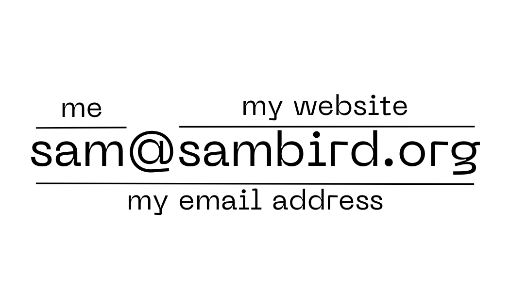

# hi there!

I'm Sam, a computer scientist and doctoral student currently at the [University of Oklahoma](https://cs.ou.edu). My academic interests are centred around database management, machine learning, quantum computing, and distributed systems. I've done a few programming projects -- for class and for fun -- that I'm pleased with, which I've listed below.

I am proficient in JavaScript, HTML/CSS, C, C++, R, SQL, Java, and Python. I have academic experience in machine learning, distributed computing, database development, and creating webservices. I have the right to work without sponsorship in the United States, the United Kingdom, and the European Union.

I am currently working under my PhD advisor, [Dr Le Gruenwald](https://cs.ou.edu/~database/faculty), as a Graduate Research Assistant.

# curriculum vitae

**Doctor of Philosophy in Computer Science**, 2025--present

- University of Oklahoma, *Norman, Oklahoma, United States*  
- Dissertation topic: 'data management using machine learning and quantum computers for large-scale database applications'
- Currently in progress

**Master of Science in Computer Science**, 2024

- University of Oklahoma, *Norman, Oklahoma, United States*  
- GPA: 4.00/4.00
- Exit exam project: 'Design and analysis of distributed memory calculations: collective communications and the Scalable Universal Matrix Multiplication Algorithm'

**Bachelor of Science in Computer Science**, 2020--2023

- University of Oklahoma, *Norman, Oklahoma, United States*  
- Graduated with distinction (GPA: 3.71/4.00)  
- Minor in Mathematics

# reports

- S Bird. [*Design and analysis of distributed memory calculations.*](/reports/summa.pdf) School of Computer Science, University of Oklahoma. 16 December 2024 [unpublished].
- S Bird. [*Collective communication on the Schooner supercomputer.*](/reports/collective_comm.pdf) School of Computer Science, University of Oklahoma. 16 August 2024 [unpublished].

# projects

I do programming projects both for school and for fun. There are a few I'm particularly proud of:

- [mysql-server](https://github.com/const-sambird/mysql-server) is a modification to the base MySQL server to add support for a few fulltext indexing methods. MySQL already supports these, but it was good to reimplement inverted indexes and suffix trees from scratch by extending the CSV engine. While very much a 'proof of concept', it was a fun challenge, though probably the trickiest project I've had to complete at university to date. The performance boost is significant, about 10x faster than a stock InnoDB lookup, but this solution would struggle to scale.
- [collectives](https://github.com/const-sambird/collectives) was my first research project for my master's degree. It examined how seven commonly used collective communication operations, implemented in three different ways, compared against each other across a range of input sizes. Effectively, it was an examination of how quickly different implementations performed on OU's Schooner supercomputer, while also enhancing my programming skills in a distributed memory environment.
- [summa](https://github.com/const-sambird/summa) was my final research project for my master's degree. It is an implementation of the Scalable Universal Matrix Multiplication Algorithm on OU's Schooner supercomputer, and was useful for benchmarking its performance against a naïve implementation of matrix multiplication. 
- [openscope-ml](https://github.com/const-sambird/openscope-ml) was my final project for an artificial intelligence class I took, based on an open source air traffic control simulator called [openScope](https://github.com/openscope/openscope) that I contributed to occasionally years ago. It's a thorough introduction to reinforcement learning, and a good example of how existing systems -- even one as simple as a JavaScript game -- could be retrofitted to incorporate AI agents into their operation.
- I've done the Hacklahoma hackathon a few times with my friend Anthony, and you can see our [2022](https://github.com/anthony-nguyen-04/Hacklahoma2022) project on GitHub, where we wrote a vaccine passport website. Some of it was written at 4am during a hackathon, but it is a functional website that implements several API endpoints, and it won 3rd prize.

# contact me

I have two email addresses:

- `sam.bird AT ou DOT edu` for things related to academics
- `sam AT sambird DOT org` will work for everything else

Feel free to reach out to me on [LinkedIn](https://www.linkedin.com/in/sam-bird-aab3382b3/).
